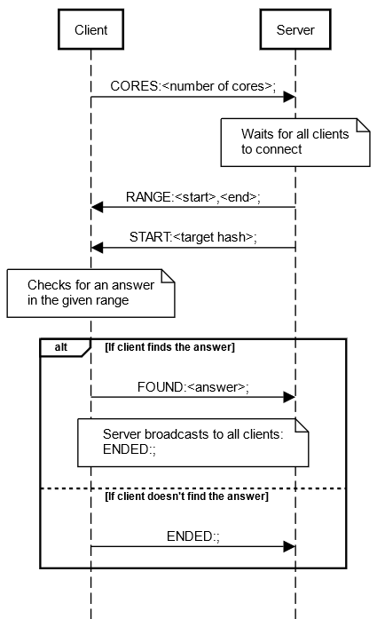

# Protocol
The protocol includes a command and arguments for that command. It is a textual protocol in the following format:

`COMMAND:arg1,arg2,...;`

The command is 5 letters, followed by a `:` and then the arguments, separated by a `,`, and at the end there is a `;`.

A command may have one argument, several arguments or none at all.

## List of commands

#### START
The server sends it to all clients when all of them are ready. It has one argument - the hash to be found. Example:

`START:a1d0c6e83f027327d8461063f4ac58a6;`

#### CORES
The client sends it to the server when connecting. It has one argument - the number of cores that the client has. Example:

`CORES:16;`

#### FOUND
The client sends it to the server when it finds an answer. It has one argument - the result it had found. Example:

`FOUND:1834;`

#### RANGE
The server sends it to all clients right before starting. It has two arguments - the start and end of this client's range to check. Example:

`RANGE:1000,2000;`

#### ENDED
This command has two uses: the server sends it to all clients when the answer is found, and the client sends it to the server if it didn't find the answer in the range given to it. It has no arguments. Example:

`ENDED:;`

## Sequence Diagram
